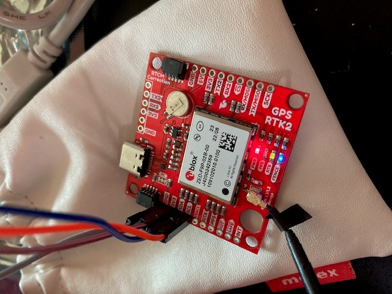
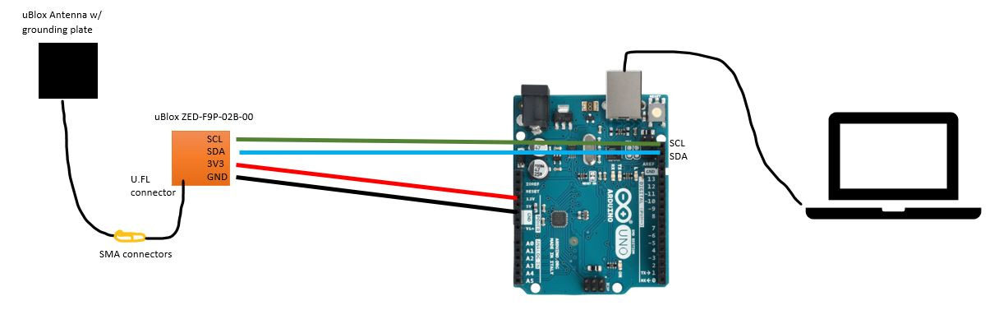

# SonarLocalization
Deep Learning approach to localizing in 3D space using spectrograms from sonar. If you are looking for code that lives on batbot6, go [here](https://github.com/BIST-Research/batbot6). This repo is dedicated to all other functions, such as parsing binary data, generating spectrograms, hooking up RTK-GPS, and running ResNet-152 and so on. 

## Problem
Can we localize ourselves in an environment using bio-mimic'd bat biosonar without GNSS?

## Background
In GNSS-denied environments, localizing in a 3D environment poses difficulties. Sonar-sensing bats have the ability to 'easily' navigate their surroundings for survival (locating and hunting prey). A robotic system that bio-mimics a bat's sonar system may be able locate itself in an a-priori (previously mapped w/ sonar) environment. Zhang et. et. proved this is [possible](https://iopscience.iop.org/article/10.1088/1748-3190/acb51f/meta) using a supervised deep learning classification model, but there is a need for field testing in bat-native environments with a higher degree of GPS-accuracy to ensure robustness and applicability.

## Approach
The problem is bounded to a given geographic location (e.g. a small forest). Training data is collected and labelled with GNSS (ideally, RTK-GPS for increased accuracy). Field research is conducted by walking through an environment and triggering a series of 'echoes' (send ultrasonic sonar out) and 'listens' (recording the reflected sound coming in). At each point where an echo/listen is obtained, GNSS coordinates are logged.  
Post-processing is conducted afterwards, which includes clustering GPS coordinates using K-means into discrete local sub-regions and generating spectrograms from the sonar reflections. This serves as the training data, which is used to train a ResNet (ML classification model).  

### New to Git?
I'm also assuming you know how to use Git and GitHub, but if you don't here's a link to an article to help you get started. 

# Machine Learning

## Training Data & Model
A given 'observation' / row of training data consists of a spectrogram (image of it). This spectrogram is fed in as an image (matrix of values). The labels (yhat) are the classified sub-regions (output of K-means on GPS coordinates).  
ResNet (need more details on what the heck this is) is trained on this data.

## Prediction
New spectrograms can be fed to the model, and a prediction of which sub-region the spectrogram came from is outputted. As the number samples are increased, the number of sub-regions can be increased to obtain finer resolution for predictions. 

# Installation & Setup
The ML code is Python, and the data is stored in MATLAB .mat files. The below setup consists of installing proper Python packages to run the. py scripts. Note that you can set things up for pure CPU usage (no GPU), or with a GPU (more advanced, and your computer also has to have a GPU of course). It is recommended that you use a Python virtual environment, though this is not necessary (you can ignore commands relating to virtual env below). These instructions were written for Unix systems. Using a virtual environment will make things easier if you screw up installation (likely to happen with tensorflow let's be real...). 

### Install for basic CPU usage (no GPU)
These steps led to a successful installation on an Ubuntu machine in June 2023. Should also work wtih windows (except for the virtual env stuff, you may want to use pycharm for that). 
0. clone this repo into a folder `git clone https://github.com/philparisi/SonarLocalization`
1. open a new terminal
2. ```cd /path/to/where/this/repo's/code/is```
3. install virtualenv ```sudo apt install virtualenv```
4. create a new virtual environment ```virtualenv nameOfYourEnv```
5. source your virtualenv (activate it) ```source nameOfYourEnv/bin/activate```
- when you are done with the environment, deactivate the env it with ```deactivate``` and then delete it with ```rm -r nameOfYourEnv```
6. install the following python packages:
- ```pip install pandas```
- ```pip install numpy```
- ```pip install keras```
- ```pip install scipy```
- ```pip install keras_applications```
- ```pip install scikit-learn```
- ```pip install matplotlib```
- ```pip install tensorflow```

7. ensure you have the data files (allspecmic2dynFM.mat and mutliple .mat files), open the CN-Resnet152-Patch-Classification.py file, and update the file locations for variables `data1` and `data3` (should be in the first 30 lines or so).

### Install for GPU usage (advanced)
These steps have not been tested yet on the same ubuntu computer.


### Training the ML Model
1. open new terminal
2. cd to the location of your virtualenv
3. source (activate) your virtualenv `source nameOfYourEnv/bin/activate`
4. run the python script `python CN-Resnet152-Patch_Classification.py`

When the script runs, tensorflow will likely output a bunch of warnings (this is typical). Only be worried if there are actual errors.  
You know things are working if the model starts going through training epochs with an output similar to below:
```bash
Epoch 1/20
1/494 [..............................] - ETA: 2:40 - loss: 0.8206 - accuracy: 0.703
2/494 [..............................] - ETA: 3:10 - loss: 0.8532 - accuracy: 0.664  
```

### Troubleshooting
This section is dedicated to specific errors and how to fix them

#### Problem 1 -- Your Computer has a GPU and TensorFlow is failing
If you do the basic install `pip install tensorflow` and your computer has a GPU (like mine) then you will probably run into some errors. My computer outputted `Epoch 1/20` but then hit an error. To fix this, I had to disable the GPU while running the program. This is because using a GPU requires a more advanced installation of tensorflow (and other compatibility things). To disable the GPU, add this to the start of your script:
```python
import os
os.environ["CUDA_VISIBLE_DEVICES"] = "-1"
```
That fixed it for me! Note that 'fixing it' in this sense means commanding tensorflow to my CPU rather than GPU. However, a more advanced use case will find a way to install tensorflow properly to get things working with a GPU. Temp fix!


# RTK GPS and Parsing

We are logging data from a ubloxGPS receiver.

The approximate links in the chain are as follows:
1. ubloxGPS antenna connects to ublox ZED-F9P PCB via SMA-U.FL connector
2. ublox circuit board module connects via I2C serial to Arduino (later this is replaced by Jetson?)
3. Arduino uses the pre-made ublox-sparkfun-GNSS toolbox/functions to parse the data
4. Arduino connects to Jetson via USB (or to a PC)
5. python script on Jetson/PC logs the GPS data

### Useful Links
Arduino I2C serial comm pins https://docs.arduino.cc/learn/communication/wire  
I2C serial basics https://www.youtube.com/watch?v=6IAkYpmA1DQ  
ZED-F9P Hookup guide https://learn.sparkfun.com/tutorials/gps-rtk2-hookup-guide/all  
Note: SDA = serial data, SCL = serial clock  

### GPS module ZED-F9P-02B-00
The GPS module is from ublox and can be connected via:
1. USB-C cable to a computer. this allows you to use uBlox's [uCenter2 software](https://www.u-blox.com/en/u-center-2)
2. or via serial pins (as shown below) over I2C to an arduino. this allows you to live parse data using the [GPS Arduino Library](https://github.com/sparkfun/SparkFun_u-blox_GNSS_v3) and then log it using a python script



The lights on the module indicate:
1. PWR (red) --> the device is powered
2. PPS (yellow blinking light, off in the picture) --> pulse-per-second output pin, blinks at 1Hz when getting basic position lock from GPS/GNSS
3. RTK (green) --> real time kinematic output pin, remains high (on) when module is in normal GPS mode, blinks when receiving the RTCM correct data (enabling RTK-GPS)
4. FENCE (blue) --> geofence output pin, idk why this on cause we didn't configure anything but this hasn't given us any issues

### Basic Test Scripts (no GPS or wiring)
#### serial_console_test.ino
This is a basic arduino script that requires no wiring (except for connecting the arduino via USB to computer). Simply pushing that file to the arduino causes the arduino to send fake data over the serial connection (from the USB), which can be viewed by the serial monitor in the arduino IDE.

To run:
1. push the code to the arduino using the arduino IDE
2. open the serial monitor (be sure the adjust the baud rate / comm port to match what the .ino specifies)

#### serial_python_test.ino with serial_python_test.py
This script also does not require any wiring (except for USB connection) and instead of the arduino IDE serial monitor to view the data being transmitted, a python script is used to read the data of the serial USB connection and logs it into a .csv.

To run:
1. push the code to the arduino using the arduino IDE
2. run the python script (be sure the adjust the baud rate / comm port to match what the .ino specifies)
 - (if WIN command prompt --> navigate to the location of the script, then type the name of the script and hit 'enter')
3. ctrl+c to stop the python logging script

### Getting GPS Data Live (w/ GPS and wiring)
#### Example1_GetPositionAccuracy.ino with Example1_GetPositionAccuracy.py
This .ino script is from the pre-built ublox arduino library. Setup is necessary -- see wiring diagram below. We have to use I2C serial comms. Connect jumper cables from the uBlox ZED-F9P (I2C contacts: GND, 3V3, SDA, SCL). The 3.3V will power the module and the SCL is a clock to time the data sent from SDA. 



To run:  
0. setup the above wiring
1. push the code to the arduino using the arduino IDE
2. run the python script (be sure the adjust the baud rate / comm port  to match what the .ino specifies)
 - (if WIN command prompt --> navigate to the location of the script, then type the name of the script and hit 'enter')
3. ctrl+c to stop the python logging script

Note you are actually using a GPS now, so you may need a proper GPS signal (i.e. outdoors will be better).

#### IRES_GPSlogger.ino with IRES_GPSlogger.py
Do not run this until you have successfully run the Example1_GetPositionAccuracy.ino/.py. That is the 'out of the box' pre-fab code that works and should be your starting point to get the system setup and logging. We wrote the .py file but the .ino came straight from uBlox.

These scripts are a modified version of the Example1_GetPosition Accuracy scripts to achieve our preferred data flow and processing approach. 

To run:  
0. setup the above wiring from the Example1
1. push the code to the arduino
2. run the python script
3. ctrl+c to stop logging

The outputted .csv file has the following columns:
- time elapsed (in arduino time since start of the program, in milliseconds)
- latitude (in degrees * 10^7)
- longitude (in degrees * 10^7)
- altitude (in millimeters)
- accuracy (in millimeters, not really sure how they're calculating this)

The name of the csv file contains the date and time when it was created, so you can combine this time with the arduino elapsed time to get time stamps.


# Post Processing


## Binary Data

## Generating Spectrograms


# Archives

## Old 'Documentation'  

### from Liujin Zhang
This sections relates to [his paper](https://iopscience.iop.org/article/10.1088/1748-3190/acb51f/meta)  
allspecmic2dynCF:  
CF echoes spectrogram from all areas, the echoes are filtered by a bandpass filter, the filtered frequency range is 58 kHz to 63 kHz, while the echo frequency is at 60 kHz.  

allspecmic2dynFM:  
FM echoes spectrogram from all areas, the echoes are filtered by a bandpass filter, the filtered frequency range is 44 kHz to 56 kHz, while the echo frequency is from 45 kHz to 55 kHz.  

gpsintall48:  
the GPS coordinates data from the data collection area, in total 37,136 echo locations, and each data point represents the longitude and latitude.  
